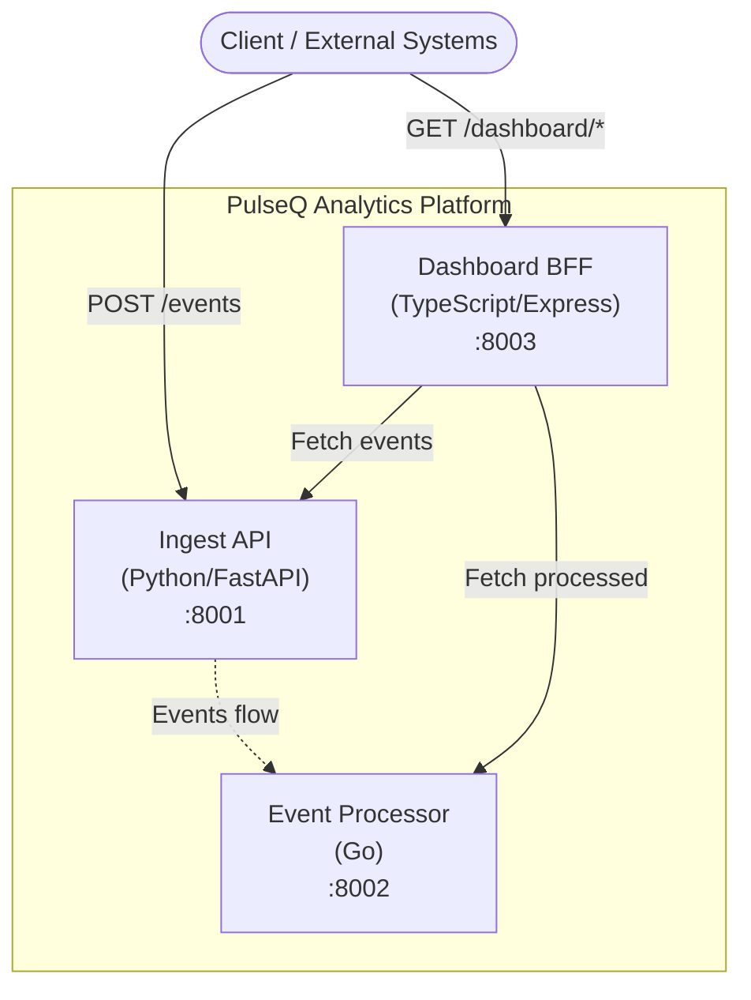

# PulseQ Analytics

Real-time event analytics pipeline built with a polyglot microservices architecture. Ingest, process, classify, and visualize events through a unified dashboard.

## Architecture



## Services

| Service | Language | Port | Description |
|---------|----------|------|-------------|
| **Ingest API** | Python (FastAPI) | 8001 | Receives and stores raw events |
| **Processor** | Go (net/http) | 8002 | Classifies events and adds tags |
| **Dashboard BFF** | TypeScript (Express) | 8003 | Aggregates data for the frontend |

## Quick Start

### Prerequisites

- Docker & Docker Compose
- (For local dev) Python 3.12+, Go 1.22+, Node.js 20+

### Using Docker Compose

```bash
# Copy environment config
cp .env.example .env

# Start all services
make up

# Verify health
curl http://localhost:8001/health
curl http://localhost:8002/health
curl http://localhost:8003/health

# Stop all services
make down
```

### Local Development

```bash
# Run all tests
make test

# Run linting
make lint
```

## API Reference

### Ingest API (`:8001`)

#### `GET /health`
Returns service health status.

**Response:**
```json
{"status": "healthy", "service": "ingest-api", "timestamp": "2024-01-01T00:00:00Z"}
```

#### `POST /events`
Ingest a new event.

**Request Body:**
```json
{
  "event_type": "click",
  "source": "web",
  "data": {"page": "/home", "button": "signup"}
}
```

**Response** (`201`):
```json
{
  "id": "uuid",
  "event_type": "click",
  "source": "web",
  "data": {"page": "/home", "button": "signup"},
  "received_at": "2024-01-01T00:00:00Z"
}
```

#### `GET /events`
List events. Query params: `event_type` (filter), `limit` (1-1000, default 100).

#### `GET /events/{event_id}`
Get a single event by ID.

### Processor (`:8002`)

#### `GET /health`
Returns service health status.

#### `POST /process`
Process and classify an event.

**Request Body:**
```json
{
  "id": "uuid",
  "event_type": "purchase",
  "source": "mobile",
  "data": {}
}
```

**Response** (`201`):
```json
{
  "id": "uuid",
  "event_type": "purchase",
  "source": "mobile",
  "data": {},
  "processed_at": "2024-01-01T00:00:00Z",
  "tags": ["transaction", "revenue", "source:mobile"]
}
```

#### `GET /processed`
List all processed events.

### Dashboard BFF (`:8003`)

#### `GET /health`
Returns service health status.

#### `GET /dashboard/summary`
Aggregated summary from all services.

#### `GET /dashboard/events`
Proxy to ingest API events.

#### `GET /dashboard/processed`
Proxy to processor processed events.

## Usage Example

```bash
# 1. Ingest an event
curl -X POST http://localhost:8001/events \
  -H "Content-Type: application/json" \
  -d '{"event_type": "purchase", "source": "web", "data": {"amount": 99.99}}'

# 2. Process an event
curl -X POST http://localhost:8002/process \
  -H "Content-Type: application/json" \
  -d '{"id": "abc-123", "event_type": "purchase", "source": "web", "data": {"amount": 99.99}}'

# 3. View dashboard summary
curl http://localhost:8003/dashboard/summary
```

## Project Structure

```
pulseq-analytics/
├── services/
│   ├── ingest-api/          # Python FastAPI service
│   │   ├── main.py
│   │   ├── test_main.py
│   │   ├── requirements.txt
│   │   └── Dockerfile
│   ├── processor/           # Go service
│   │   ├── main.go
│   │   ├── main_test.go
│   │   ├── go.mod
│   │   └── Dockerfile
│   └── dashboard-bff/       # TypeScript Express service
│       ├── src/
│       │   ├── app.ts
│       │   ├── app.test.ts
│       │   └── index.ts
│       ├── package.json
│       ├── tsconfig.json
│       └── Dockerfile
├── .github/workflows/ci.yml
├── docker-compose.yml
├── Makefile
├── .env.example
├── .gitignore
└── README.md
```

## CI/CD

GitHub Actions workflow runs on every push and PR to `main`:
1. **Python tests**: flake8 lint + pytest
2. **Go tests**: go vet + go test
3. **TypeScript tests**: eslint + jest
4. **Docker build**: Validates all Dockerfiles build successfully

> **Note:** The `.github/workflows/ci.yml` file may need to be manually added after initial repository setup due to GitHub API restrictions on the `.github/` directory.

## Environment Variables

See [`.env.example`](.env.example) for all available configuration options.

## License

MIT
